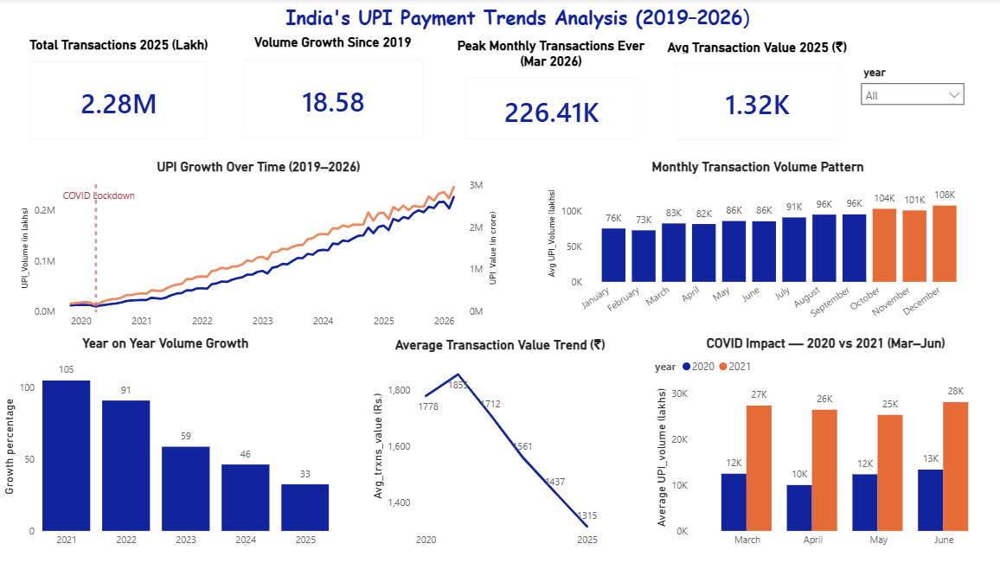

# 📊 India's UPI Payment Trends Analysis (2019–2026)

Mapping India's Digital Payment Behavior Using RBI Public Data

📌 Problem Statement

"India's UPI ecosystem has grown explosively over 6 years — but when did it truly take off, which months see the highest volumes, how resilient is it to external shocks like COVID, and what does the declining average ticket size tell us about who is using UPI today?"

📦 Dataset

DetailInfoSourceReserve Bank of India (RBI) — data.rbi.org.inTablePayment System Indicators — Table No. 45CoverageNovember 2019 to March 2026FormatMonthly UPI transaction volume (Lakh) and value (₹ Crore)CredibilitySame data RBI publishes in its official annual reports

🔧 Tools Used

ToolPurposePython (pandas)Data extraction and cleaning from messy government Excel fileSQL (MS SQL Server)Business analysis — 8 queries across 4 analytical chaptersPower BIInteractive dashboard with 5 visuals and 4 KPI cardsGitHubProject documentation and version control

📋 Project Structure

rbi-upi-analysis/
│
├── data/
│   ├── raw/          ← Original RBI Excel file
│   └── clean/        ← Cleaned CSV after Python processing
│
├── notebooks/
│   └── upi_data_cleaning.ipynb    ← Python cleaning steps
│
├── sql/
│   └── upi_analysis.sql           ← All 8 business queries
│
├── charts/                        ← Dashboard screenshots
└── README.md

🔍 Business Questions Answered

📈 Chapter 1 — Growth Story

Q1 — How many times has UPI volume grown from 2019 to 2026?
Q2 — Which year saw the highest % growth?
Q3 — Which months ever saw a drop compared to the previous month?

📅 Chapter 2 — Seasonality Story

Q4 — Which months consistently see the highest transaction volumes?
Q5 — Which quarter consistently performs best across all years?

👤 Chapter 3 — User Behavior Story

Q6 — Is the average transaction value going up or down year by year?
Q7 — Has value grown faster or slower than volume?

🌍 Chapter 4 — External Events Story

Q8 — How did COVID (Mar–Jun 2020) impact UPI vs the same months in 2021?

💡 Key Findings

18.58x volume growth from November 2019 to March 2026 — one of the fastest growing payment systems globally
2021 was the breakout year at 105% YoY growth — driven by post COVID digital adoption
Average transaction value has declined from ₹1,855 in 2021 to ₹1,315 in 2025 — confirming mass market penetration into everyday small value payments
October, November, December consistently peak every year — festive season (Diwali) drives a clear seasonal pattern
Q4 average volume is 35% higher than Q1 — fintechs should scale infrastructure before October every year
COVID caused only a 2 month dip — April 2020 dropped 19.83% but April 2021 recovered 164% — COVID accelerated rather than damaged UPI adoption.

Dashboard Features

4 KPI cards — Total Transactions 2025, Volume Growth Since 2019, Peak Month Ever, Avg Transaction Value 2025
5 interactive visuals covering growth, seasonality, behavior and COVID impact
Year slicer for dynamic filtering
COVID lockdown reference line on growth chart.

🚀 How to Run This Project

Python Cleaning

Clone this repository
Install dependencies:

bashpip install pandas openpyxl

Open notebooks/upi_data_cleaning.ipynb in Jupyter Notebook
Update FILE_PATH to point to the raw Excel file in data/raw/
Run all cells — upi_clean_data.csv will be generated in data/clean/

SQL Analysis

Open SQL Server Management Studio (SSMS)
Create a new database: upi_transactions
Import data/clean/upi_clean_data.csv using Tasks → Import Flat File
Open and run sql/upi_analysis.sql

Power BI Dashboard

Open Power BI Desktop
Connect to SQL Server → localhost → upi_transactions
Load upi_clean_data table
Visuals and measures are pre-built in the .pbix file 

Data Source: Reserve Bank of India — data.rbi.org.in
